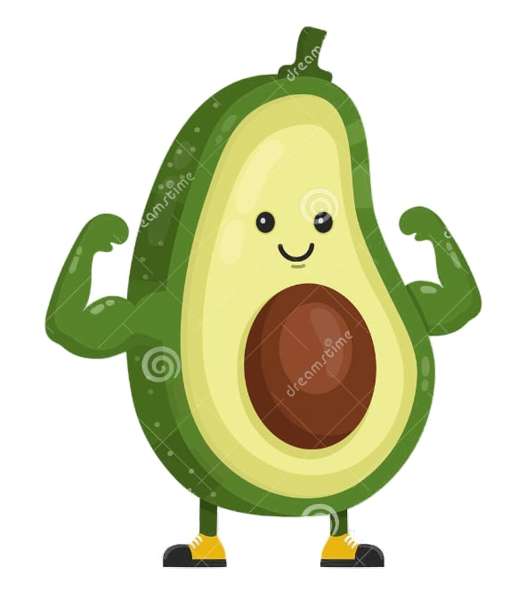

<!-- PROJECT LOGO -->
 

  

  <h3 align="center">My Food Buddy</h3>

  

<!--     An awesome README template to jumpstart your projects! -->
     
    <a href="https://www.figma.com/file/xVy9SQQKyk29mRrHVWiUNC/ITP-prototype">Link to Figma Demo</a>
<!--     · -->
<!--     <a href="https://github.com/othneildrew/Best-README-Template/issues">Report Bug</a> -->
<!--     · -->
<!--     <a href="https://github.com/othneildrew/Best-README-Template/issues">Request Feature</a> -->
  

<!-- Motive of THE PROJECT -->
## Motive of The Project
The original project is a part of this initiative under the healthy eating domain and the goal was to design a gamified Nutritional-Healthy Eating app targeted at low-income families, specifically at young pre-school children aged 5 and above and their parents. The app aims to motivate users to learn more about healthy and nutritional eating habits and aims to to encourage bonding time between parents and their children through its use and help inculcate healthy eating habits for the whole family.

(<a href="#top">back to top</a>)

<!-- Project Objective -->
## Project Objective
The primary objective of this project is to design and propose an application that can encourage users from lower income families to make healthier food choices when eating out, purchasing groceries, and creating quality time as a family while maintaining the affordability. To achieve this, the “My Food Buddy” solution encompasses the following features:
1. Gamified design to encourage child users.
2. “Grocery Hunter” and “Meal Helper” to encourage the family to spend quality time and educate children on a healthy diet in a gamified manner.
3. In-game store to create an entertainment factor for children to learn the healthy diet information.

(<a href="#top">back to top</a>)

<!-- Game -->
## Boss Fight Gameplay
Users can compete against the daily boss in the Raid Battle for exclusive gifts that can only be won by defeating the boss. Users with healthy character would deal more damage to the enemy boss than a character with unbalanced stats. Users would be given rewards based on their achievement in the raid battle. Users are shown the “Come Back Tomorrow” button once they have attempted the boss raid. The Users can start a new boss raid on the next day. 

https://user-images.githubusercontent.com/17755848/181719740-ca11abbf-805a-4ff2-97c6-a1195c6f38b7.mp4

<!-- Meal Helper -->
## Meal Helper
The meal helper allows users to plan their meals when eating out by selecting the food they want to eat from the recommended tab or by manually searching at the search bar.The user is then shown the various macronutrients information regarding the meal and is also shown how it adds to their overall nutrition via the “Healthy Plate” diagram.Users are then shown nutrition tips and a simplified view of how the nutrients in the previous information page will affect their mascot’s health bar.

https://user-images.githubusercontent.com/17755848/181720660-59141aae-b787-4e99-b3d6-ce24ab9b4911.mp4

<!-- Grocery Hunter -->
## Grocery Hunter 
It is a scavenger hunt activity that users will be able to play when their parents bring them along while shopping in a supermarket. There will be QR codes placed around the supermarket. Each QR code will represent a featured food which will complement a healthy diet. The QR codes will be scannable through the application, which will contain additional information about the food. The purpose of this scavenger hunt is to educate users and show them a wide variety of healthy foods, encouraging them to try something they might like. Scanning the QR codes also earns Buddy Coins which can be spent in the buddy store.

https://user-images.githubusercontent.com/17755848/181720672-9dd17242-afb6-4ba8-a2fb-c94e28b806a8.mp4

<!-- Customization -->
## Customization
This personalisation feature creates a sense of ownership for their buddy. The current customisation options include different buddies, furniture, and houses. Each item is priced differently, depending on how ‘premium’ it looks. This price differentiation will also create a small sense of competitiveness among their friends.

https://user-images.githubusercontent.com/17755848/181724179-5c9638ed-ce93-4096-a6b6-5f9ebd27ab54.mp4

<!-- # Figma Prototype
https://www.figma.com/file/xVy9SQQKyk29mRrHVWiUNC/ITP-prototype -->

# Storyboard
## When a child purchases a meal and plays with the meal hunter

## When a child goes to fairprice to play the grocery hunter game

[Storyboards.docx](https://github.com/ShawnLemuelDabi/ITP-Group-18/files/9032617/Storyboards.docx)
# Game Mechanics

# Workshop Survey

